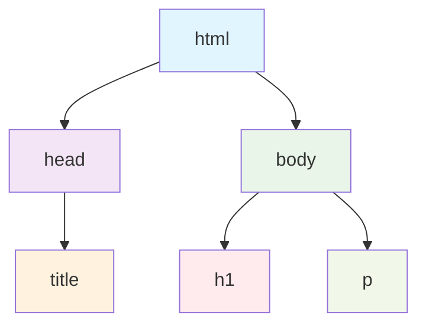

<div class="text-center text-white mt-2 mb-8">
  <div class="text-5xl font-bold mb-8">从 Web 页面编程基础到 React 开发</div>
  <div class="text-2xl mb-4">张家轩 goudanZ1</div>
  <div class="text-xl">2025.07.20</div>
</div>

<div class="flex justify-center mb-10">
```html
<div class="text-center text-white">
  <p class="text-5xl font-bold mb-8">从 Web 页面编程基础到 React 开发</p>
  <p class="text-2xl mb-4">张家轩 goudanZ1</p>
  <p class="text-xl">2025.07.20</p>
</div>
```
</div>

<div class="flex items-center justify-center text-xl text-white">
  <a class="space-x-2" href="https://github.com/thepkuhub/pkuhub_developer_tutorial" target="_blank">
    <carbon:logo-github />
    <span>PKUHUB Developer Tutorials</span>
  </a>
</div>

<style>
.slidev-layout {
  background: linear-gradient(to bottom, #18599a 0%, #388e7f 100%);
}
.slidev-code {
  padding: 10px 25px !important;
  border-radius: 8px !important;
  font-size: 16px !important;
}
</style>

---

# 为什么要学前端？

<div class="mt-20">
  
</div>

---

# 为什么要学前端？

<div class="mt-8">2024 年上海地区程序员年薪（只包含固定薪资）中位数：</div>

**算法**：￥311519

**后端（以 Java 为例）**：￥212160

**前端**：￥184960

**运维**：￥166200

**测试**：￥138920

<div class="mt-10 text-sm opacity-50">

数据来源：[程序员鱼皮](https://space.bilibili.com/12890453) 的 [博客](https://www.bilibili.com/opus/949035090680217619)，整理自 BOSS 直聘网站，统计了百万量级的样本（但似乎只有认证成为招聘者才能获取这些薪资数据）

BOSS 直聘网站上还有一些无需登录就能查询到的数据：[不同地区岗位平均月薪](https://www.zhipin.com/salaryxc/c101020100_p100101.html)（直接在网页内修改查询条件），[职业发展详情](https://baike.zhipin.com/wiki/sc2e7827a4a75738d1nJz)

</div>

---

# 为什么要学前端？

<div class="flex justify-center mt-5">
  
</div>

<div class="mt-3 text-sm opacity-50 text-center">
Vue 创始人尤雨溪转发 X 推文，这么有实力的前端相关开发者都找不到工作
</div>

---

# 为什么要学前端？

<div class="flex justify-center mt-5">
  
</div>

<div class="mt-3 text-sm opacity-50 text-center">
PKUHUB Developer Tutorials 第三次讲座
</div>

---

# 为什么要学前端？

为什么在 AI 如此发达的时代下我们还是要学习前端开发？

<div v-click>
我对 AI 说：“帮我完成一页 slide，主题是：为什么在 AI 如此发达的时代下我们还是要学习前端开发？”
</div>

<div v-click class="flex justify-center mt-3">
  
</div>

---

# 为什么在 AI 如此发达的时代下我们还是要学习前端开发？

## 🔍 **理解与判断能力**
- AI生成的代码需要人工审查和优化
- 基础扎实才能识别代码质量和潜在问题
- 能够判断AI建议的合理性和适用性

## 🛠️ **问题解决能力**
- 复杂业务逻辑仍需人工设计和实现
- 调试和性能优化需要深入的技术理解
- AI无法完全理解项目的具体需求和约束

## 🏗️ **架构设计思维**
- 系统架构和技术选型需要人工决策
- 代码可维护性和扩展性的考量
- 团队协作和代码规范的制定

## 🚀 **创新与适应能力**
- 新技术的学习和应用需要基础作为支撑
- 能够将AI工具更好地集成到开发流程中
- 适应技术变化，而不是被技术淘汰

<div class="absolute bottom-5 right-5 text-sm opacity-60">
AI是工具 🤖，能力是基础 🧠
</div>

<arrow v-click x1="540" y1="380" x2="380" y2="520" color="#32b7e7" width="3" />

<arrow v-click x1="750" y1="210" x2="550" y2="110" color="#32b7e7" width="3" />

---

# 为什么在 AI 时代下我们还是要学习前端开发？

<div v-click>

- 想让 AI 自己在修改代码后执行构建命令是可行的，但 AI（暂时应该）还没有“看见”成品、体验交互的能力

</div>

<div v-after>

- AI 也许很容易就能写出没有语法问题的代码，但它不会有从渲染出的网页中发现问题、解决问题的能力和审美，可能只能基于代码的语义来“空想”

</div>

<div v-click>

- 只有人类才能看出的一些问题：颜色不太好看，文字行距有点小，页面边距有点小，图标和文字看起来好像没对齐（尽管代码逻辑上绝对是对齐的），过长的文本被挤得意外换行了、意外溢出了……

</div>

<div v-after class="flex justify-center my-3">
  
</div>

<div v-click>

- 最理想的解决方案当然就是由人类程序员定位到出问题的代码片段，边尝试调整边看效果，直到符合期望；即便你准备使用 AI 而不是手动改代码，学习前端知识也可以帮助你把问题描述得更加清晰，你会更加清楚现有的框架下“能够做到什么”、某处的代码“本应该做到什么”，甚至是“大概应该怎么改”

</div>

<style>
.slidev-layout h1 {
  margin-bottom: 1.1rem;
}
.slidev-layout li {
  margin-top: 0.5rem;
  line-height: 1.5em;
}
</style>

---

# 为什么在 AI 时代下我们还是要学习前端开发？

<div v-click>

- AI 训练的语料可能跟不上技术发展的动向，在技术选型方面可能会稍显落后，对新的或者小众的东西也可能不怎么会写（开联网搜索/给它喂文档大概会有所帮助）

</div>

<div v-click>

- 对于我们同学来说，如果想要实现自己的 idea，独立做一个面向用户的小项目，可能前端反而会比后端更重要（小项目几乎遇不到什么后端性能瓶颈，后端完全让 AI 写都行，能正确地完成业务功能就足够了，更重要的是前端用户界面是否好看合理，假如 AI 风格太过明显或者页面显示有明显问题，可能就会大降印象分）

   - 而且在 React Server Components 提出后，React 的服务端功能越发完善，像 Next.js 这样的全栈 React 框架本身就可以很好地集成简单的后端服务了

</div>

<div v-click>

- 在树洞上修改绩点（误）

</div>

<div v-click>

- 可以做出更好看的笔记，比如在 Markdown 中用 CSS 调整布局，修改文字、图片、表格的样式，用 Marp、Slidev 等框架做 slides

</div>

<style>
.slidev-layout h1 {
  margin-bottom: 1.2rem;
}
.slidev-layout li, .slidev-layout p {
  margin-top: 0.8rem;
  line-height: 1.6em;
}
</style>

---

# 目录

<div class="mt-8">

1. <Link to="/2">为什么要学前端？</Link>

   - <Link to="/8">为什么在 AI 时代下我们还是要学习前端开发？</Link>

2. <Link to="/11">Web 页面编程基础</Link>

   - <Link to="/12">HTML</Link>
   
   - <Link to="/20">CSS</Link>
   
   - <Link to="/26">JavaScript</Link>
   
   - <Link to="/28">从三大件到 React</Link>

3. <Link to="/31">React 开发</Link>
   
   - <Link to="/37">深入理解 props、组件树重新渲染</Link>

4. <Link to="/41">项目实战：超简易版树洞</Link>

</div>

---

<div class="mb-6">

# Web 页面编程基础

</div>

1. **HTML** 组织页面内容

2. **CSS** 设定元素样式

3. **JavaScript** 实现动态交互

<br>

- 只需要熟悉关键的思想和方法，比如这三项技术各自能做到什么事情、大概要怎么去写，没必要硬记边边角角的语法

---

# HTML：组织页面内容

<div class="mt-5">
$$
f(x) = \frac{a + \log _b x}{c \cdot d ^x} - x
$$
</div>

<div v-click class="mt-5">怎么把这个 LaTeX 公式打出来呢？</div>

<div v-click class="mt-3">

- 首先按照正常的顺序从左到右写，右边有一个大分式

<div class="flex justify-center mt-1">
```latex
f(x) = \frac{ ... }{ ... } - x
```
</div>

</div>

<div v-click class="mt-3">

- 往里填分子，分子也是从左到右正常写，只有小一号且对齐底端的 `b` 是特殊的

<div class="flex justify-center mt-1">
```latex
f(x) = \frac{ a + \log _b x }{ ... } - x
```
</div>

</div>

<div v-click class="mt-3">

- 分母同理，只有小一号且对齐顶端的 `x` 是特殊的

<div class="flex justify-center mt-1">
```latex
f(x) = \frac{ a + \log _b x }{ c \cdot d ^x } - x
```
</div>

</div>

---

# HTML：组织页面内容

<div class="mt-3">
$$
f(x) = \frac{a + \log _b x}{c \cdot d ^x} - x
$$
</div>

<div class="flex justify-center items-center -mt-2 gap-4">
LaTeX:
```latex
f(x) = \frac{ a + \log _b x }{ c \cdot d ^x } - x
```
</div>

<div class="flex justify-center items-center mt-2 gap-4">
HTML:
```html {*|1-3,13-15|3,4,8,9,12,13|4-8|9-12|*}
<span 子元素横着排>
  <span> f(x) = </span>
  <span 子元素竖着排 相邻的子元素之间有横着的线>
    <span 子元素横着排>
      <span> a + log </span>
      <sub> b </sub>
      <span> x </span>
    </span>
    <span 子元素横着排>
      <span> c · d </span>
      <sup> x </sup>
    </span>
  </span>
  <span> - x </span>
</span>
```
</div>

<div v-click class="-mt-3 text-xs opacity-50 text-center">

*&nbsp;这里只是为了便于理解才这样写，实际上纯文本节点不需要套一层 `<span>` `</span>`，且行内默认就是横着排，无需特意指定

</div>

---

# HTML：组织页面内容

<div>

可以把下面这段代码放到 <a href="https://play.tailwindcss.com" target="_blank">Tailwind Play</a> 里试一下，我没有骗你，HTML 确实就是这样写的（样式具体怎么写会在 CSS 部分介绍）：

</div>

<div class="flex justify-center mt-2">
```html
<span class="flex items-center gap-2">
  f(x) =
  <span class="flex flex-col items-center divide-y">
    <span> a + log <sub> b </sub> x </span>
    <span> c · d <sup> x </sup></span>
  </span>
  - x
</span>
```
</div>

<style>
h1 + div p {
  line-height: 1.7;
}
</style>

---

# HTML：组织页面内容

Hyper Text Markup Language - 超文本标记语言

- **标记语言**：HTML 规定了一组标签（如 `<span>`），标签各自有不同的语义，用于组织页面内容

- **声明式编程**：所见即所得，这些标签的内容就是页面上的内容，标签的组织结构就是页面内容的结构，这是一种静态的描述方式，不像 C 或 Python 等编程语言是要在代码里规定程序做什么事情

<div v-click>

下面是一个完整的 HTML 文档：

<div class="flex justify-center items-center gap-8 -mt-2">

```html
<!DOCTYPE html>
<html>
  <head>
    <title>今日新闻</title>
  </head>
  <body>
    <h1>震惊！大学生在寝室内泪流满面</h1>
    <p>原因竟是麦当劳薯条太好吃了</p>
  </body>
</html>
```


</div>

</div>

<style>
.slidev-layout li, .slidev-layout p {
  margin-top: 1rem;
  line-height: 1.6em;
}
.slidev-code {
  padding: 10px 15px !important;
}
</style>

---

# DOM 树与 HTML 元素

<div>当用户在浏览器中打开 HTML 文件时，浏览器会解析这个文档，并在内存中建立对应的 <b>DOM 树</b>，然后才根据这棵树将页面内容显示在浏览器上</div>

<div v-click class="flex justify-center gap-20">

<div>

<div class="-my-1">

HTML 文档（文本文件）：

</div>

```html
<!DOCTYPE html>
<html>
  <head>
    <title>今日新闻</title>
  </head>
  <body>
    <h1>震惊！大学生在寝室内泪流满面</h1>
    <p>原因竟是麦当劳薯条太好吃了</p>
  </body>
</html>
```

</div>

<div class="max-w-64">

<div class="-my-1">

DOM 树：

</div>



</div>

</div>

<div v-click>

DOM 即 Document Object Model（文档对象模型），将整个文档抽象为一个树形结构，树的每个节点都视为一个可访问的 **HTML 元素**，标签的嵌套关系就是 HTML 元素在 DOM 树中的父子关系，顺序排列的标签就是 DOM 树中的兄弟节点

</div>

<style>
.slidev-layout p {
  line-height: 1.6em;
}
.slidev-code {
  padding: 10px 15px !important;
}
</style>

---

<div class="mb-7">

# 常见的 HTML 元素及其属性

</div>

<div>

根据书写形式，HTML 元素可以分成两类：

</div>

- 一类有头和尾两个标签，如 `<div> ... </div>`（中间可以嵌入其他 HTML 元素）

- 一类只有一个标签，如 ``（也称为自闭合标签，通常表示独立的元素，中间不需要包含任何内容）

<div v-click class="mt-7">

可以在元素的 **第一个标签** 里设置元素的 **属性**，如：

`<div id="card-container" class="item container">`

</div>

<div v-after class="mt-7">

可以给任何 HTML 元素设置 `id` 和 `class` 这两个属性，用于标识元素（寻找方式是：`id` 为 ... 的元素，`class` 包含 ... 的元素）

- 元素的 `id` 必须在整个文档内是唯一的

- 一个元素可以同时具备多个 `class`，一个 `class` 也可以对应不止一个元素，可以为具有某种共性的一类元素都添加同一个 `class`，便于统一选取

</div>

---

# 常见的 HTML 元素及其属性

- `<p>我是理塘丁真。</p>`：paragraph，用于组织文本段落，前后自动添加换行符

- `我是<span>理塘丁真</span>。`：行内元素，前后不自动添加换行符

- `<div> ... </div>`：division，将文档分割成不同的部分，通常作为其他元素的容器，为子元素统一设置样式
 
- `<h1>我的个人主页</h1>`：标题，支持 `h1` 到 `h6` 六级标题

<div v-click class="flex justify-center items-center gap-8">

```html
<div class="container">
  <h1>北京地区大学分类</h1>
  <div class="card">
    <span>1. 北京大学</span>
    <button>点赞（0）</button>
  </div>
  <div class="card">
    <span>2. 其他大学</span>
    <button>点赞（0）</button>
  </div>
</div>
```

<div>
  
  <div class="text-sm opacity-50 mt-4">按首字母排序，没有任何其他意思</div>
</div>

</div>

<style>
.slidev-code {
  padding: 10px 15px !important;
}
</style>

---

<div class="mb-7">

# 常见的 HTML 元素及其属性

</div>

- 超链接：<a href="https://www.kfc.com.cn" target="_blank">取消课程优秀率限制通知.pdf</a>
  
  <div class="w-fit mb-3">

  ```html
  <a href="https://www.kfc.com.cn">取消课程优秀率限制通知.pdf</a>
  ```

  </div>

  - `href` 即 hypertext reference，用于指定超链接的目标资源的 url，作为点击超链接后跳转到的位置

- 图片：
  
  <div class="ml-12 -mt-10 mb-3">
    
  </div>
  
  <div class="w-fit mb-3">

  ```html
  
  ```

  </div>

  - `src` 指定图片的来源路径，`alt` 设定未加载好图片时显示的替代文本

---

# CSS：设定元素样式

Cascading Style Sheets - 层叠样式表

一个样式表包含了一组 **样式规则**，用来设定特定的 HTML 元素的样式

<div class="flex justify-center">
  
</div>

<div class="text-sm opacity-50 text-center">
图片来自《JavaScript 语言 Web 程序设计》课件（张伟老师）
</div>

---

# CSS 选择器

- `p`：选择所有元素名（标签名）为 `p` 的元素

- `.container`：选择所有具有 `container` 类（class 中包含 `container`）的元素 

- `#header`：选择 id 为 `header` 的（唯一）元素

- 交集选择器 `p.container.card`：选择所有同时具有 `container` 类和 `card` 类的 `p` 元素

- 后代选择器 `.container p`：选择所有 **有一个具有 `container` 类的祖先元素** 的 `p` 元素（提出 DOM 树概念的好处）

- 子代选择器 `div > p`：选择所有 **父元素的元素名是 `div`** 的 `p` 元素

- 伪类选择器 `button:hover`：选择所有“鼠标指针悬浮在其上”的 `button` 元素，即设定一个按钮在悬浮状态下样式应该如何变化


---

# CSS 样式属性

我让 AI 帮我分类列举了一些

<div class="grid grid-cols-2 gap-8 -mt-3">

<div>

文本样式：

```css
.text-style {
  color: #333;              /* 文字颜色 */
  font-size: 16px;          /* 字体大小 */
  font-weight: bold;        /* 字体粗细 */
  line-height: 1.5;         /* 行高 */
}
```

背景与边框：

```css
.box-style {
  background-color: #f8f9fa;     /* 背景颜色 */
  background-image: url('bg.jpg'); /* 背景图片 */
  border: 2px solid #007bff;     /* 边框 */
  border-radius: 8px;              /* 圆角 */
}
```

</div>

<div>

布局：

```css
.layout {
  width: 300px;             /* 宽度 */
  height: 200px;            /* 高度 */
  margin: 20px auto;        /* 外边距 */
  padding: 15px;            /* 内边距 */
  display: flex;            /* Flexbox 布局 */
  justify-content: center;  /* 水平居中 */
  align-items: center;      /* 垂直居中 */
}
```

</div>

</div>

---

# CSS 全局样式表的问题

Cascading Style Sheets - 层叠样式表

<div v-click class="mt-5">

- CSS 的工作过程总是要先选择特定的元素，再设定其样式。当项目变得复杂，新的类名和 id 会越来越难想。而且如果元素结构嵌套较深，命名几乎就离不开 container，wrapper，box，card，content 这种没什么语义的词，没营养而且费脑细胞。

</div>

<div v-click class="mt-5">

- “层叠”的问题：当多条有冲突的样式规则作用于同一个元素时，哪一条规则优先级最高？不够严谨的选择器设计可能会导致样式混乱，既不知道现在的效果是哪条规则生效了（需要在浏览器的开发者工具里查看），也不知道改这里的一条规则是不是会影响到别的什么地方

</div>

<div v-click class="mt-5">

- 如果使用了很多复杂选择器（懒得命名），那么这些样式规则具体会应用于哪些元素就强烈依赖于 HTML 内容结构（DOM 树结构），就不太好去改动 HTML 了

</div>

---

# Tailwind CSS

<div class="grid grid-cols-2 gap-8">
<div>

### 传统写法：

<div mt-4>

```html
<button class="primary-button">
  点我
</button>
```

</div>
<div mt-4>

```css
.primary-button {
  border-radius: 8px;
  padding: 4px 8px;
  background-color: oklch(54.6% 0.245 262.881);
  color: white;
}
.primary-button:hover {
  background-color: oklch(70.7% 0.165 254.624);
}
```
</div>

</div>
<div>

<div v-click>

### Tailwind CSS：

<div mt-4>

```html
<button class="rounded-lg px-2 py-1 bg-blue-600
               text-white hover:bg-blue-400">
  点我
</button>
```
</div>
</div>

<div v-click mt-4>

内置 utility classes，无需开发者手动编写：
```css
.rounded-lg { border-radius: 8px; }
.px-2 { padding-inline: 8px; }
.py-1 { padding-block: 4px; }
.bg-blue-500 { background-color: ... ; }
.text-white { color: white; }
.hover\:bg-blue-400 { ... }
```
</div>

</div>
</div>

<button class="rounded-lg px-2 py-1 bg-blue-600
               text-white hover:bg-blue-400">
  点我
</button><span v-after ml-98>
体验：<a href="https://play.tailwindcss.com" target="_blank">Tailwind Play</a>
</span>

---

# Tailwind CSS：新的 CSS 范式

> Building complex components from a constrained set of primitive utilities.
> 
> 从一组受限的原始实用程序类构建复杂的组件。

<div v-click>

每个元素仅需少量的类，一个类是多个样式的组合

→ 只需使用预构建好的原子类，每个类只设置一个样式，多个原子类拼好饭共同组成一个元素的样式

</div>

<div mt-3 v-click>

- 极大地减少代码量，不用再想类名了

</div>

<div mt-3 v-click>

- 样式跟着元素走，改动 DOM 树结构不会再有后顾之忧

</div>

<div mt-3 v-click>

- 看似限制了 CSS 样式值的选择自由（比如颜色只能从预构建好的那些中选，当然也完全支持自定义），实际上是减少了设计负担，使得整个网站的 ui 风格更容易统一

</div>

<div mt-3 v-click>

- 支持状态变体（`hover:bg-blue-400`）和响应式变体（`md:px-2`），真的可以在 `class=" ... "` 字符串中轻松实现原本需要复杂 CSS 的功能

</div>

---

# JavaScript 语法速览

<div class="grid grid-cols-2 gap-8">

<div>

**变量声明**（驼峰命名法）：

```javascript
// 变量与值的引用关系不可改变
const userName = '小张';
const userAge = 20;

// 变量与值的引用关系可以改变
let currentPage = 1;
let isLoading = false;
```

**对象**：

```javascript
const user = { name: '张三', age: 20 };
console.log(user.name);
user.age += 1;  // 可以，没有改变变量和值的引用关系

user = { name: '张三', age: 21 };
// 不行，这是直接赋了一个新值给 user
```

</div>

<div class="-mt-18">

**函数**：

```javascript
// 声明函数
function greetUser(name) {
  return `你好, ${name}!`;
}

// 这样也能声明函数（类似于匿名函数，lambda 表达式）
const addNumbers = (a, b) => a + b;

console.log(greetUser('小明'));
console.log(addNumbers(5, 3));
```

**列表/数组**：

```javascript
const numbers = [1, 2, 3, 4, 5];
console.log(numbers[0]);
numbers.push(6);  // 向末尾添加
numbers.pop();    // 从末尾弹出

// 对数组里的每个元素调用 forEach 括号里接收到的函数
numbers.forEach(number => {console.log(number);});

// 对每个元素调用 map 括号里接受到的函数，返回值组成新数组
const numberStrs = numbers.map(num => num.toString());
```

</div>

</div>

---

# 用 JavaScript 控制 DOM 树，实现动态交互

JavaScript 是为了网页而生的！

<div class="grid grid-cols-2 gap-8 -mt-4">
<div>

**HTML 结构：**

```html
<div class="container">
  <h1>北京地区大学分类</h1>
  <div class="card">
    1. 北京大学
    <button id="pku-btn">点赞</button>
    当前点赞数：<span id="pku-count">0</span>
  </div>
  <div class="card">
    2. 其他大学
    <button id="other-btn">点赞</button>
    当前点赞数：<span id="other-count">0</span>
  </div>
</div>
```

</div>
<div>

**JavaScript 交互逻辑：**

```javascript
// 获取按钮和计数器元素：querySelector 函数接收 CSS 选择器
// 字符串，返回整个 DOM 树中查询到的第一个 HTML 元素，元素
// 的类型是 object，有 children, parentNode 等属性
const pkuBtn = document.querySelector('#pku-btn');
const pkuCount = document.querySelector('#pku-count');

// 为北大点赞按钮设置点击事件发生时触发的函数
pkuBtn.onclick = () => {
  let count = parseInt(pkuCount.textContent);
  pkuCount.textContent = count + 1;
};

// 下面“其他大学”同理
const otherBtn = document.querySelector('#other-btn');
const otherCount = document.querySelector('#other-count');
otherBtn.onclick = () => {
  let count = parseInt(otherCount.textContent);
  otherCount.textContent = count + 1;
};
```

</div>
</div>

---

# 从三大件到 React

<div class="grid grid-cols-3 gap-6 -mt-2">
<div>

**HTML 组织页面内容**

```html
<div class="container">
  <h1>北京地区大学分类</h1>
  <div class="card">
    1. 北京大学
    <button id="pb">点赞</button>
    当前点赞数：
    <span id="pc">0</span>
  </div>
  <div class="card">
    2. 其他大学
    <button id="ob">点赞</button>
    当前点赞数：
    <span id="oc">0</span>
  </div>
</div>
```

</div>
<div>

**CSS 设定元素样式**

```css
.container {
  margin: 20px;
}

.card {
  width: 300px;
  border: 1px solid #dee2e6;
  border-radius: 8px;
  padding: 15px;
  margin: 10px 0;
}

button {
  background-color: #007bff;
  color: white;
  border-radius: 8px;
}
```

</div>
<div>

**JavaScript 实现动态交互**

```javascript
const pb = document.
           querySelector('#pb');
const pc = document.
           querySelector('#pc');
pb.onclick = () => {
  pc.textContent = 
    parseInt(pc.textContent) + 1;
};

const ob = document.
           querySelector('#ob');
const oc = document.
           querySelector('#oc');
ob.onclick = () => {
  oc.textContent = 
    parseInt(oc.textContent) + 1;
};
```

</div>
</div>

---

# 从三大件到 React

<div class="grid grid-cols-3 gap-6 -mt-4">
<div class="col-span-2">

**HTML + Tailwind CSS**

```html
<div class="m-5">
  <h1>北京地区大学分类</h1>
  <div class="w-72 border border-gray-300 rounded-lg p-4 my-2">
    1. 北京大学
    <button class="bg-blue-500 text-white rounded-lg px-3 py-1 ml-2"
      id="pb">点赞</button>
    当前点赞数：<span id="pc">0</span>
  </div>
  <div class="w-72 border border-gray-300 rounded-lg p-4 my-2">
    2. 其他大学
    <button class="bg-blue-500 text-white rounded-lg px-3 py-1 ml-2"
      id="ob">点赞</button>
    当前点赞数：<span id="oc">0</span>
  </div>
</div>
```

</div>
<div class="col-span-1">

**JavaScript 实现动态交互**

```javascript
const pb = document.
           querySelector('#pb');
const pc = document.
           querySelector('#pc');
pb.onclick = () => {
  pc.textContent = 
    parseInt(pc.textContent) + 1;
};

const ob = document.
           querySelector('#ob');
const oc = document.
           querySelector('#oc');
ob.onclick = () => {
  oc.textContent = 
    parseInt(oc.textContent) + 1;
};
```

</div>
</div>

<div v-click>

- 现在 `.card`, `button` 的样式分散到了各个元素上，如果想改的话得所有地方一起改，反而增添了麻烦
- 学校不同，但按钮的行为是相似的；从整个文档里定位元素还是不太自然，交互逻辑最好也跟着 HTML 走

</div>

---

# React：有的兄弟，有的！

React 是一个用于构建前端用户界面的 JavaScript 库，采用 **组件化开发** 的思想


<div class="grid grid-cols-2 gap-6 -mt-4">
<div>

**定义 SchoolCard 组件：**

```jsx
function SchoolCard({ name }) {
  const [likes, setLikes] = useState(0);
  
  const handleLike = () => {
    setLikes(likes + 1);
  };
  
  return (
    <div className="w-72 border border-gray-300 ...">
      {name}
      <button 
        className="bg-blue-500 text-white ..."
        onClick={handleLike}
      >点赞</button>
      当前点赞数：{likes}
    </div>
  );
}
```

</div>

<div>

**在根组件中导入该组件：**

```jsx
function App() {
  return (
    <div className="m-5">
      <h1>北京地区大学分类</h1>
      <SchoolCard name="1. 北京大学" />
      <SchoolCard name="2. 其他大学" />
    </div>
  );
}
```

</div>


</div>


---

# React 基础概念

参考：<a href="https://react.dev/learn/describing-the-ui">React 官方教程</a>

**组件**：应用程序中可复用的 UI 元素，实际上就是一个返回 JSX 标签（形式上类似于 HTML 标签，实质上类似于 DOM 树中的对象）的 JavaScript 函数

```jsx
export default function Profile() {
  return (
    
  );
}
```

- `export default` 前缀是标准 js 语法，用于导出一个文件中的主要函数，以便在其他文件中导入它

- 组件的名称（`Profile`）必须 **以大写字母开头**！


---

在其他组件中使用该组件：

```jsx
export default function Gallery() {
  return (
    <section>
      <h1>Amazing scientists</h1>
      <Profile />
      <Profile />
      <Profile />
    </section>
  );
}
```

- `<section>` 和 `<h1>` 首字母是小写的，因此会被解析为普通的 HTML 标签

- `<Profile />` 首字母是大写的，因此会被解析为 React 组件，从而被替换为 ``

- 这里可以认为 `Gallery` 是一个父组件，每个 `Profile` 是其子组件

- 事实上整个程序（整个页面）都是一个组件，称为 **根组件**

--- 

# 从 HTML 标签到 JSX 标签

<div>例如下面这段代码，返回值是完全符合 HTML 语法的 HTML 标签，但并不符合 JSX 语法，因而无法正常工作：</div>

```jsx
export default function TodoList() {
  return (
    // This doesn't quite work!
    <h1>Hedy Lamarr's Todos</h1>
    
    <ul>
      <li>Invent new traffic lights
      <li>Rehearse a movie scene
      <li>Improve the spectrum technology
    </ul>
  );
}
```

---

JSX 是对 JavaScript 的语法扩展，一个组件返回的 JSX 标签实际上会被转化为 **一个 JavaScript 对象**，因此：

- 返回值必须是 **一个根元素**（一个 js 函数不能直接返回多个对象），如果要返回多个元素则需要用一个父标签把它们包裹起来，例如 `<div> ... </div>` 或 `<> ... </>`

- **标签必须闭合**，像 `` 这样的自闭合标签必须写成 ``，`<br>` 必须写成 `<br />`，而像 `<li>oranges` 这样只有开始标签的元素必须带有闭合标签，改为 `<li>oranges</li>`

- 标签的属性要用 **DOM 属性** 的方式（驼峰命名法）命名，而不是 HTML/CSS 语法中的属性名（JSX 标签的属性会被转换为 js 对象的属性，自然也需要按照 js DOM 的规范来命名），比如 `stroke-width` 需要改为 `strokeWidth`；特别地，`class` 需要改为 `className`，因为 `class` 是 js 中的保留字

--- 

# 在 JSX 标签中通过大括号使用 JavaScript

<div>

在 JSX 标签中，能且只能在以下两种场景中通过大括号使用 JavaScript，以动态地改变组件渲染的内容：

</div>

- 标签内的文本

- 标签属性的值（正常情况下只能将引号包裹的字符串传递给属性）

```jsx
export default function Avatar() {
  const name = 'Gregorio Y. Zara';
  return (
    <>
      <h1>{name}'s To Do List</h1>
      
    </>
  );
}
```

---

# 将 props 传递给子组件

<div>

<b>props</b> 是父组件传递给子组件的信息，用于动态地指定子组件的渲染方式，形式上是 **子组件函数接收的参数**。从这个视角来看，在上面的例子中 `className`, `src`, `alt` 等都是传递给 `` 的 props。我们也可以类似地对我们自己定义的组件传入 props。

</div>

<div class="grid grid-cols-2 gap-6">

```jsx
function Avatar({ person, size }) {
  return (   // 这里 person 是一个对象
    
  );
}
```

```jsx
export default function Profile() {
  return (
    <div>
      <Avatar size={100}
        person={{ 
          name: 'Katsuko Saruhashi', 
          imageUrl: 'https://i.imgur.com/YfeOqp2s.jpg'
        }}
      />
      <Avatar size={80}
        person={{
          name: 'Aklilu Lemma', 
          imageUrl: 'https://i.imgur.com/OKS67lhs.jpg'
        }}
      />
    </div>
  );
}
```
</div>

---

# props 是父组件到子组件的单向数据流

**props 是只读的时间快照**，只能反映子组件收到那组参数时那组参数的值

<div v-click mt-2>

- React 将组件视为一个 **状态机**，如果组件接收到的 props 不变，外部环境和自身状态不变，那就应当认为它输出的 JSX 是稳定的，不需要重新渲染；同时，组件不应该尝试修改自己接收到的 props，因为它只能由父组件单向地传递给子组件

</div>

<div v-click mt-2>

- 因此组件会被触发重新渲染当且仅当 React 核心认为它输出的 JSX 可能会发生变化，即：组件接收的 props 发生变化，或组件自身的 state 发生变化（暂时不考虑外部环境 context）

</div>

<div v-click mt-2>

- 然而组件接收的 props 是从父组件传过来的，父组件为什么会传过来一个不一样的 props 呢？那自然是因为父组件被重新渲染了，才会用不一样的 props 来调用子组件，返回不一样的 JSX！

</div>

<div v-click mt-2>

- 因此 React 里发生的所有“重新渲染”事实上都来源于 **状态的变化**，我们如果希望用户的行为（比如按了一下按钮）会触发页面内容变更，就应当将这个行为和某个组件的状态挂钩：用户按下按钮后，这个组件的状态发生变化，然后这个组件会被重新渲染，它可能会对它所调用的一部分子组件传入不一样的 props，进而引发这部分子组件被重新渲染，沿着组件树往下一层层触发……

</div>

---

# React 组件树的重新渲染

<div class="flex justify-center">
  
</div>


---

# React 组件树的重新渲染

<div class="flex justify-center">
  
</div>

- 接收的 props 不变的组件不必重新渲染，保证了重新渲染的性能开销最低

---

# useState Hook：为组件添加状态

<div class="flex justify-center">
  
</div>

这里的按钮按下了，怎么让那里的数字变呢？（如何触发那个数字的重新渲染）

- 将 **状态提升** 到两者最近的共同父组件中

```jsx
function SchoolCard({ name }) {
  // 申请获得一个状态，默认值是 0
  const [likes, setLikes] = useState(0);
  
  // 把这个处理函数传给按钮，按下按钮后更新状态
  const handleLike = () => { setLikes(likes + 1); };
  
  return (
    <div>{name}
      <button onClick={handleLike}>点赞</button>
      当前点赞数：{likes}
    </div>
  );
}
```

--- 

# 项目实战：超简易版树洞

基于 Next.js 框架

<div class="flex justify-center">
  
</div>

<div class="flex justify-center mt-5">
  <a href="https://github.com/goudanZ1/treehole-demo">https://github.com/goudanZ1/treehole-demo</a>
</div>