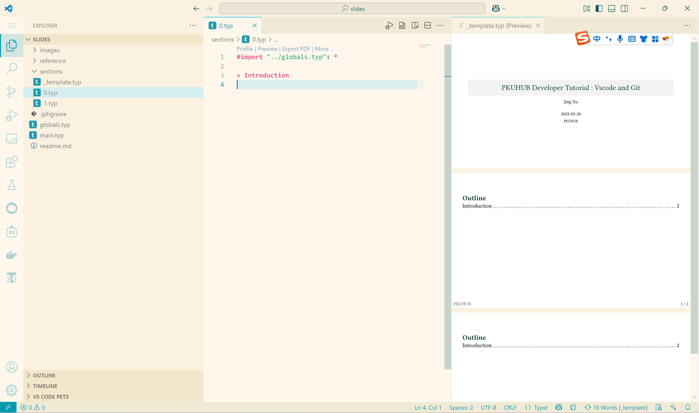

# PKUHUB Developer Tutorial
PKUHUB 内部开发技术讲座 slides

## 讲座目录

| 讲座 | 主题 | 讲者 |
|------|------|------|
| Lecture 1 | VS Code & Git 基础 | xj |
| Lecture 2 | Web 部署实践 | - |
| Lecture 3 | AI 编程与 Rust 入门 | - |
| Lecture 4 | Rust 基础（上） | - |
| Lecture 5 | React 前端开发 | - |
| Lecture 6 | Rust 进阶（下） | ICUlizhi |
| Lecture 7 | LLM 深度解析：从训练到推理 | PKUHUB |

___
## 讲者请看
推荐 Tinymist Typst , Typst Companion 两款 vscode 插件

- [排版原神, 启动](https://typst-doc-cn.github.io/guide/)
- [Touying](https://touying-typ.github.io/zh/), 我们暂时采用 Dewdrop 主题

#### 项目文件结构
注意看引用关系
```bash

.

├── sections
│   ├── _template.tpy  # 模板文件, 用于渲染单个章节
│   ├── 0.tpy          # Introducion 章节
│   ├── 1.tpy          # xj 的 vscode & git 章节
├── main.tpy           # 主文件, 用于打包渲染所有章节
├── global.tpy         # 全局变量
```
工作界面belike:

___

