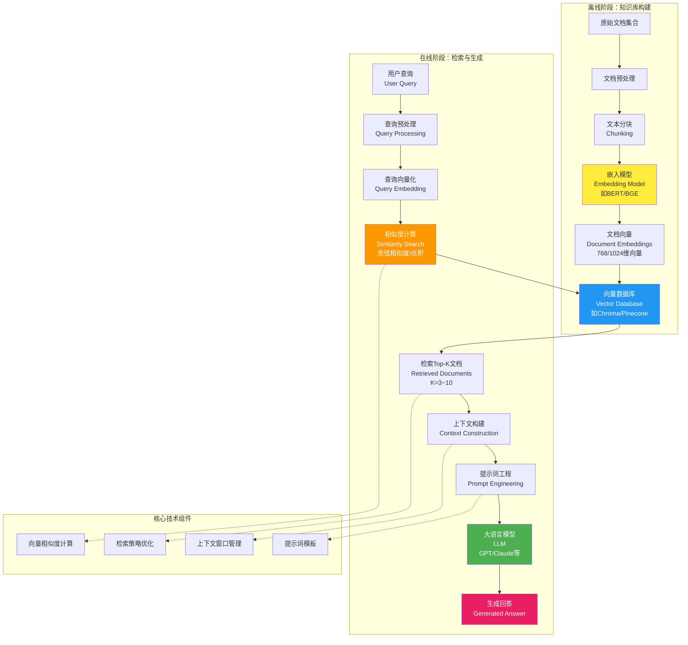

# 开始
自我介绍
# AI大模型的简单介绍
## OpenAI
OpenAI旗下有两个AI系列，首先是GPT系列,AI界的大明星，在2022年底GPT3.5向公众开放（22年新闻周刊标题“ChatGPT火出圈”是我第一次听到（当时还在疫情封校）），经过两年GPT4.0后，终于迭代到了GPT4.5（实际能力不如GPT4o）。

OPenAI最大的优势是客户端做的非常好，官网下的GPT能调用多种工具，比如python解释器，可以用python完成很多事情，比如处理excel（这边演示我招生的一个案例），处理word（比如可以让他把上万字塞到word的两页中（生成cheetsheet））

还有就是GPT可以P图（图片是我朋友用4o恶搞我的图片）这边演示一下

还有是O系列，AI界的学霸，O1刚开放的时候，openai宣称其是博士水平的智商，并且成为当时一段时间唯一的推理模型，我当时为了写概率论的作业不得已充了openai会员，作业有一半是O1帮我写的，真的很强（后来被deepseek r1碾压了）。
然后是O3，是目前openai最新的推理模型(O2因为商标被别人注册了（官方直博自己说这一版太强了，所以直接跳过O2）) O3是目前排行榜上排名最高的AI，其在2025年全国一卷考了138，GPT4o在2024年还是不及格，甚至不到60分，大模型在数学考试从不及格到接近满分，只用了1年，

官方版O3的首次引入了图片思考和深度思考，这边展示，其如何识别未名湖精确位置，其甚至给出了我镜头的机位（虽然不对）（网上有新闻爆出，O3可以识别大部分街道的具体坐标，准确率90%以上，所以知道你在哪，只需要一张照片）

openai还有深度研究，可以让其对一个问题深入分析，适合写论文。

最近还推出了codex，是一个适用于编码的agent，之前用它写过python的大作业，但是现在没会员了，可以自己去尝试

## claude

 编程之王,claude-4-sonnet 和claude-4-opus 是目前最牛的编码模型,也是调用插件最出色的模型（不论是API还是官网）

 在官网环境下，最好的一点是有arifact 插件,可以实时渲染生成的html,js 等代码。也可以导入github仓库，基于仓库的源码修改项目

 claude还擅长处理数据，就是给一大堆数据，让其归类之类的。

 ## gemini

 重点是免费，演示如何免费获取（好吧已经过期了，6.30号之前才能免费,不要灰心，后边还会演示如何免费获取其API，以及如何使用）

 emini-2.5-pro:最强模型，没有之一!我曾经拿20 年CMO 竞赛题目测试,Gemini2.5 pro 51 分守银(这个成绩够来北大了),不过思考的有点慢,40 分钟一道题(比我快的多，我不会). 25 年数学高考145,为大模型中第一名。
deepseek 最终得分为9分。

deep research类似openai的深度研究，搜索众多网页生成报告（报告质量一流）。

canvas类似claude的arifact。

veo3：史上第一个可以生成高清晰视频外加声音的模型。

## deepseek

- 最大优势是免费开源。

- 无法识别图片（可以识别图片中的文字）

- deepseek v3：编码能力和前端能力一流

- deepseek r1：数学问题解答一流，编码能力更强

# AI工具

## lobechat+云雾

有的人比较贪心哈，啥都想要，就比如我，上面那些模型我都想要，该咋办？
可能有同学发现了我用的这个工具,lobechat，其本质就是一个集合调用API+插件的前端。
什么是API
大模型 API（Application Programming Interface） 是大型语言模型提供商为开发者提供的接口服务，允许第三方应用程序通过编程方式调用和使用这些强大的 AI 模型。

核心概念
API 本质上是一个"桥梁"，让不同的软件系统能够相互通信。在大模型语境下，API 允许你：

发送文本请求给 AI 模型
接收模型生成的回答
控制生成参数（如温度、长度限制等）
访问不同类型的模型能力（文本、图像、语音等）

原理就是
这幅图展示的是LobeChat作为AI聊天工具的完整工作原理。当你在LobeChat界面上输入一个问题时，整个系统就开始运转了。首先，你的输入会被LobeChat的前端界面接收，同时系统还会考虑你可能使用的插件功能以及需要管理的对话历史记录。

接下来，LobeChat会将你的问题和相关设置打包成一个API调用请求，这个请求就像是一封信件，里面包含了你的问题、你希望使用的模型类型、以及一些技术参数。这个API调用会被发送到相应的大模型服务器，比如OpenAI的服务器或者其他AI公司的服务器。

大模型服务器收到这个请求后，就开始工作了，它会运行复杂的AI算法来理解你的问题并生成一个合适的回答。这个过程可能需要几秒钟的时间，因为AI需要处理大量的信息和计算。一旦AI生成了回答，服务器就会把这个回答打包返回给LobeChat。

最后，LobeChat接收到这个回答后，会将它格式化并显示在你的聊天界面上，这样你就能看到AI给出的完整响应了。整个过程就像是你通过LobeChat这个"翻译官"与远在云端的AI大脑进行对话，LobeChat负责让这个对话过程变得简单易用，而真正的智能计算则在后台的服务器上完成。

可以在服务器上部署（展示我的）

也可以直接下载客户端（目前是开发板），然后介绍云雾，走一遍流程

## lobechat+通义听悟+课程回放

展示这个pipeline

  - 通义听悟:阿里巴巴推出的对视频处理的AI工具,可以实现语音转文字,智能PPT提取,以及内容总结等等.
把转成的pdf放到lobechat的知识库当中，就可以提问课堂上讲的内容，实测对CV导论这种高度教考一体的课非常有效。
原理:大模型不可能接受这么长的上下文，那么我们怎么有效提问上课的细节的呢。这里用到的技术名字叫RAG

首先是离线阶段的知识库构建过程。在这个阶段，系统需要处理大量的原始文档，比如PDF文件、Word文档、网页内容等等。这些文档首先会经过预处理，清理掉一些无用的格式信息，然后进行文本分块，也就是把长文档切割成合适大小的片段，因为AI模型处理信息时有长度限制。接下来，系统会使用嵌入模型，比如BERT或者BGE这样的模型，将每个文本块转换成数学向量，通常是768维或1024维的高维向量，这些向量能够捕捉文本的语义信息。所有这些文档向量最终会被存储在向量数据库中，比如Chroma或Pinecone这样的专门数据库，这样就建立了一个可以快速搜索的知识库。

然后是在线阶段的检索与生成过程，这是用户实际提问时发生的事情。当用户输入一个查询时，系统首先会对查询进行预处理，然后使用同样的嵌入模型将用户的问题也转换成向量。接下来就是关键的相似度计算步骤，系统会在向量数据库中搜索与用户查询向量最相似的文档片段，通常使用余弦相似度或点积来计算相似程度。系统会检索出最相关的Top-K个文档，通常K设置为3到10个。

找到相关文档后，系统会进行上下文构建，将检索到的文档内容组织成一个连贯的上下文。然后通过提示词工程，将用户的原始问题和检索到的上下文信息整合成一个完整的提示词，发送给大语言模型。最后，GPT或Claude这样的大语言模型会基于提供的上下文信息生成一个准确的回答。

## noteboolm

和上面类似
不同的点在于其可以生成播客，思维导图等等

# AI辅助编程

AI辅助编程工具，这些工具正在彻底改变程序员的工作方式。首先要介绍的是Cursor，这是一个以AI为核心的代码编辑器，它的目标是通过深度集成人工智能技术从根本上提升开发者的编程效率。你可以把Cursor理解为一个被AI魔改过的VS Code，因为它保留了VS Code所有大家熟悉的核心功能和操作习惯，但在这个基础上赋予了它强大的AI能力。Cursor的获取方式很简单，新注册用户可以免费试用两周，如果你注册很多号的话理论上可以一直免费使用，当然这种做法我们不推荐。

接下来是Windsurf，这个工具在体验上跟Cursor差不多，UI界面设计得更好看一些，获取方式也是和Cursor一样的免费试用模式。然后我们要重点说一下GitHub Copilot，这可以说是AI编程助手中的真神级存在。GitHub Copilot最大的优势是只需要认证GitHub教育版本，就可以获得长达4年的免费使用时间，而且功能上可以用的模型也比较多样化，这对学生用户来说是非常划算的选择。

如果你想获取GitHub的学生认证，可以参考专门的GitHub学生认证教程，网上有很多详细的指导。最后我想总结一下AI辅助编程工具能干的主要事情。第一个功能是代码补全，AI可以根据你前面写的代码智能建议下一行代码，这个功能一般使用GPT3.5模型，在Copilot等工具中通常用的是专门训练的4o模型。第二个功能是代码问答，当你遇到编程问题时可以直接向AI提问。第三个功能是从零开始编写项目，AI可以帮助你快速搭建项目框架和核心功能。

这些AI编程工具的出现真的是程序员的福音，它们不仅能提高编程效率，还能帮助初学者更快地学习和掌握编程技能，让编程变得更加智能和高效。

## AI辅助编程实践

idea得自己想：这边以一个例子AI驱动的代码重构与讲解工具 (AI-Powered Code Refactor & Tutor)

然后让AI生成方案：

然后演示agent编码

最后演示部署到服务器

