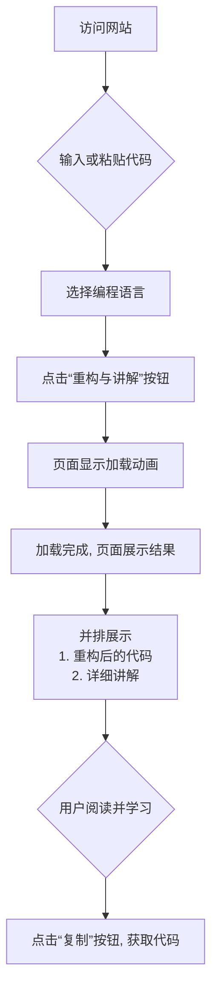

### **产品需求文档 (PRD): AI代码重构与讲解工具**

**版本:** 1.0 (MVP)
**项目代号:** CodeTutor
**负责人:** (产品经理)
在5000端口运行，接受所有访问

API baseurl :http://10.129.240.151:3000/v1

API key:sk-hAB8vCa20ckdQjm_gr1heKSK7vD7JnaFL3qxdj90XTjbBFeSDN8OuxqF_qQ

模型名称为deepseek-v3-250324

#### 1. 愿景与目标

**愿景 (Vision):** 成为每一位初级开发者和学生的首选AI代码导师，通过“重构+讲解”的模式，将代码优化从一个“黑盒”过程转变为一个透明、可学习的成长机会。

**核心理念:** 我们不仅仅是一个代码优化工具，**我们是一个学习工具**。产品的灵魂在于“讲解”，它模拟了一位资深开发者为新人做Code Review的体验，帮助用户理解“为什么”要这样改，而不仅仅是“怎么”改。

**MVP目标 (Minimum Viable Product Goals):**

1.  **核心价值验证:** 验证市场对“AI生成讲解”这一核心功能存在真实需求。
2.  **技术可行性验证:** 确保后端AI调用、前端结果展示的流程顺畅、可靠。
3.  **收集初步反馈:** 收集早期用户对讲解质量、易用性的反馈，为后续迭代提供方向。

---

#### 2. 目标用户 (Target Audience)

1.  **主要用户群体：编程初学者**
    *   **画像:** 计算机科学专业的学生、参加编程训练营的学员。
    *   **痛点:** 写出的代码能够运行，但不知道如何写出“好”的代码。缺乏即时、有效的反馈，学校或机构的讲师无法随时提供帮助。
    *   **需求:** 渴望理解代码优化的原则，而不仅仅是得到一个“正确答案”。

2.  **次要用户群体：初级开发者**
    *   **画像:** 0-2年工作经验的软件工程师。
    *   **痛点:** 代码在团队Review中经常被指出规范、性能或结构问题。希望在提交代码前自我改进，提升代码质量。
    *   **需求:** 一个快速、私密、无压力的工具来预审和优化自己的代码。

---

#### 3. 核心功能 (MVP Scope)

为了快速验证核心价值，MVP将严格限制功能范围，只包含最核心的路径。

| 功能模块           | 优先级 | 描述                                                         | 验收标准                                                     |
| :----------------- | :----- | :----------------------------------------------------------- | :----------------------------------------------------------- |
| **主页与代码输入** | **高** | 提供一个简洁的页面，包含一个文本区域供用户粘贴代码。         | 1. 页面加载成功。 2. 用户可以无障碍地将代码输入到文本框中。 |
| **语言选择**       | **高** | 一个简单的下拉菜单，允许用户选择代码的编程语言（MVP支持Python, JavaScript）。 | 1. 下拉菜单包含预设选项。 2. 用户选择后，能将该信息传递给后端。 |
| **核心处理触发**   | **高** | 一个清晰的“重构与讲解”按钮。                                 | 1. 点击按钮后，前端向后端发送请求。 2. 在等待后端响应时，前端必须显示加载状态（如Spinner）。 |
| **结果展示**       | **高** | 并排或上下布局，清晰地展示“重构后的代码”和“修改讲解”。       | 1. 左侧（或上侧）为代码区，右侧（或下侧）为讲解区。 2. 代码区应有语法高亮。 3. 讲解区能正确渲染Markdown格式（如列表、粗体）。 |
| **结果复制**       | **中** | 为“重构后的代码”提供一键复制功能。                           | 点击按钮后，代码成功复制到用户剪贴板。                       |

---

#### 4. 用户流程与界面设计

**用户核心流程图:**

**页面线框图 (Wireframe):**

这是一个极简的页面布局概念，旨在说明功能布局。

```mermaid
graph TD
    subgraph "AI Code Tutor"
        direction TB
        A("<h1>AI代码重构与讲解</h1>")
        B("<h2>贴入你的“坏”代码，让AI帮你优化和讲解</h2>")
        C("<textarea placeholder='在这里粘贴你的代码...'></textarea>")
        D("<select><option>Python</option><option>JavaScript</option></select>")
        E("<button>🚀 重构与讲解</button>")
        subgraph "结果区 (加载后显示)"
            direction LR
            F("<h3>重构后的代码</h3><pre><code>...</code></pre>")
            G("<h3>为什么这么改？</h3><div>...详细讲解...</div>")
        end
    end

    style F fill:#f9f9f9,stroke:#333
    style G fill:#f9f9f9,stroke:#333
```

---

#### 5. 技术实现概要

*   **前端:** Vanilla HTML, CSS, JS。使用 `fetch` API 与后端通信。为了美观和开发效率，可引入一个轻量级的CSS库（如Pico.css）和代码高亮库（如highlight.js）。
*   **后端:** Python Flask。提供一个API端点 (`/api/refactor`)，接收代码和语言，调用LLM API，然后将结果格式化为JSON返回。
*   **AI服务:** 依赖第三方大语言模型API（如OpenAI, Gemini等）。**这是项目的核心能力来源，也是唯一的外部依赖。**

---

#### 6. 关键成功指标 (Success Metrics)

由于是MVP，我们不关注复杂的商业指标，而是关注核心价值验证：

1.  **使用率:** `每日/每周代码提交次数` > 100次 (表明存在基本需求)。
2.  **任务成功率:** `成功返回结果的请求 / 总请求数` > 95% (衡量技术链路的稳定性)。
3.  **用户满意度 (定性):** 在页面上放置一个简单的“这次讲解对你有帮助吗？(是/否)”的投票按钮，收集初步反馈。`“是”的比例` > 70% 是一个积极信号。

---

#### 7. 风险与应对策略

| 风险点               | 可能性 | 影响   | 应对策略                                                     |
| :------------------- | :----- | :----- | :----------------------------------------------------------- |
| **AI讲解质量不稳定** | **高** | **高** | 核心体验受损，用户不信任产品。 **(1) Prompt调优：** 设计非常精确的系统指令(System Prompt)，引导AI稳定输出高质量、格式正确的讲解。 **(2) 设立预期：** 在UI上明确标注“AI生成内容仅供参考”。 |
| **API调用成本**      | **中** | **中** | 早期用户量大可能导致成本失控。 **(1) 模型选择：** MVP阶段可使用成本较低但性能尚可的模型。 **(2) 速率限制：** 对单个IP进行简单的请求频率限制，防止滥用。 |
| **API响应时间过长**  | **中** | **高** | 用户等待超过10-15秒会失去耐心。 **(1) 前端优化：** 必须有明确的加载状态提示，管理用户等待预期。 **(2) 后端优化：** 未来可探索流式(Streaming)响应，让用户先看到部分结果。 |
| **安全与隐私**       | **低** | **高** | 用户可能粘贴包含敏感信息的代码。 **(1) 免责声明：** 在页面显著位置放置隐私提示，告知用户不要提交敏感或专有代码。 **(2) 数据策略：** 后端服务承诺不在数据库中存储任何用户提交的代码。 |

---

*   *   

